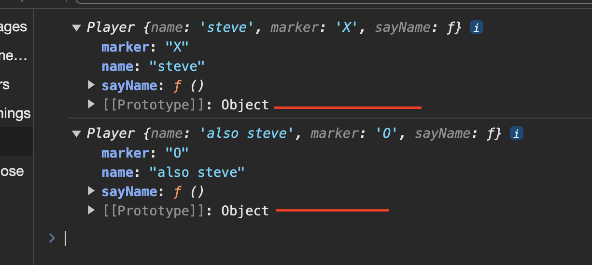
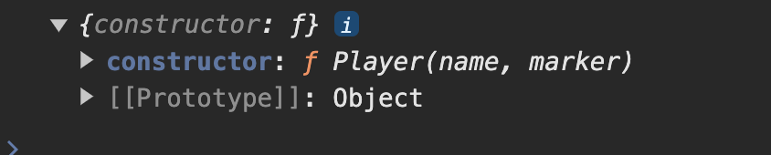

# Objects and Prototypes

1. All objects in JavaScript have a prototype

2. The prototype is another object…

#### Accessing an objects prototype

`console.log(Object.getPrototypeOf(player1));`

-   Here we will get back the `.prototype` property of the Object constructor. In this example, we will get the constructor for `Player`
-   

#### Prototypal Inheritance

This is how JavaScript makes use of prototype. By having objects contain a value - to point to prototypes and inheriting from those prototypes, and thus forming a chain.

JavaScript figures out which properties exist on the object and which do not. It traverses the chain to find the property or function!

Example: Checking for the `.valueOf` function

1. Is the `.valueOf` function part of the `player1` object? No, it is not. (Remember, only the `name`, `marker` and `sayName` properties are part of the `Player` objects.)

2. Is the function part of the `player1`’s prototype (the `Object.getPrototypeOf(player1)` value, i.e., `Player.prototype`)? No, only the `.sayHello` function is a part of it.
3. Well, then, is it part of `Object.getPrototypeOf(Player.prototype) (=== Object.prototype`)? Yes, `.valueOf` is defined on Object.prototype! Remember that Player.prototype inherits Object.prototype and the `.valueOf` function is there

##### Example

On the fiel `prototypal_inheritance.js` we the following chain:
Object.Protoype -> Person.prototype -> Player.prototype

This means that
Player.prototype inherits from Person.prototype. Person Prototype inherits from Object.prototype

#### Note:

1. Every `prototype` object inherits from `Object.prototype` by default.
2. An object’s `Object.getPrototypeOf()` value can only be one unique `prototype` object.
3. Object.setPrototypeOf(), the prototype chain has to be set up using this function before creating any objects.
